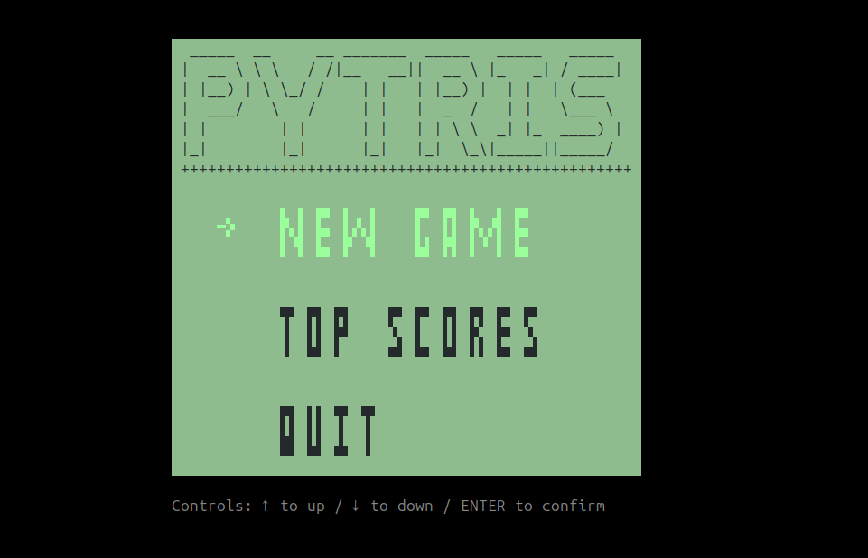
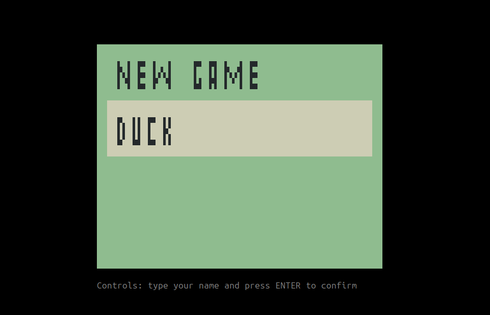
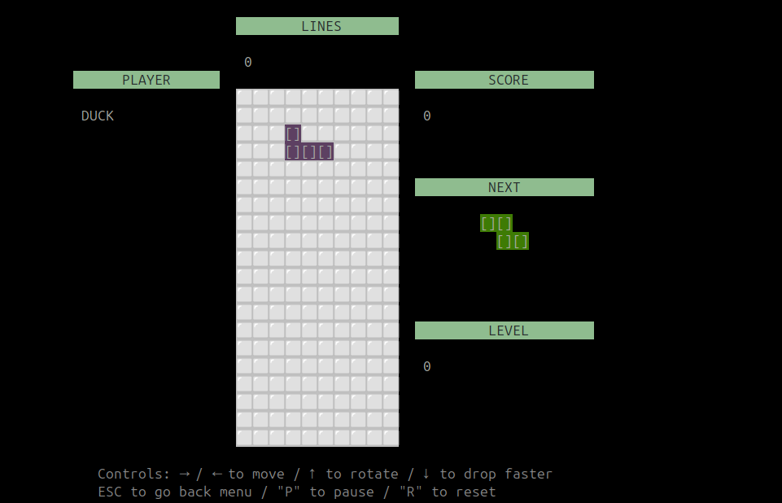
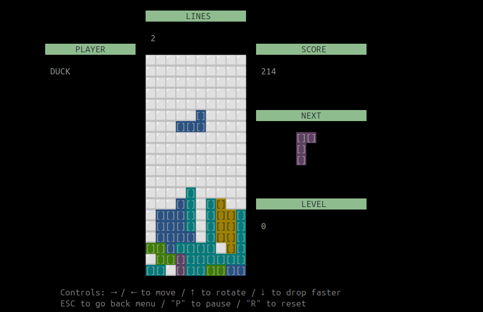
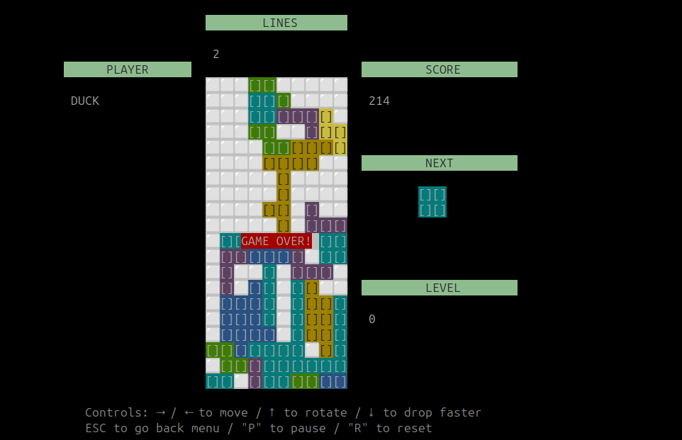
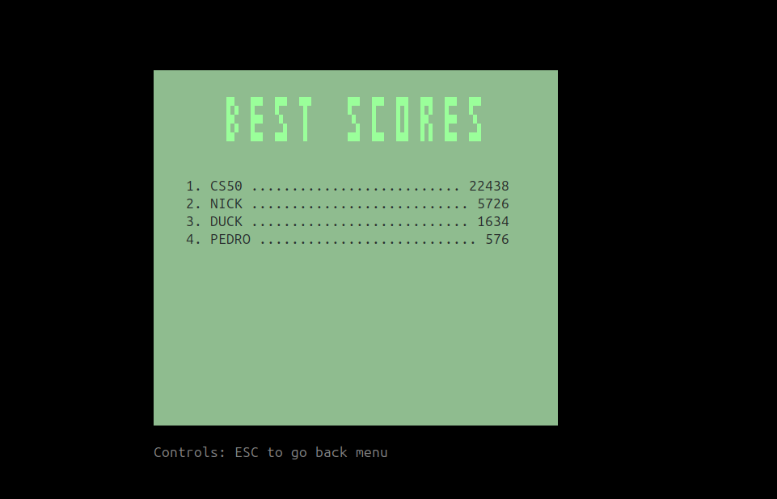

# Pytris

#### Video Demo: https://youtu.be/yr0HB0iwDO4

#### Description

A simple python game that runs on the terminal

#### Main Dependencies

- python 3.13.5
- pysqlite 2.8.3
- blessed 1.21.0

#### Create ENV

```bash
python -m venv env
```

#### Active ENV

```bash
source env/bin/activate
```

#### Deactivate

```bash
deactivate
```

#### Create requiments.txt

```bash
pip freeze > requirements.txt
```

#### Run

```bash
python main.py
```

#### Run on watch mode

```bash
watchfiles 'python main.py' .
```

#### Keep console size

Keep the console at a minimum of 100x30

#### Screenshots








#### Game functioning

Tetris is one of the most famous games in history, created by a single person: the Russian Alexey Pajitnov, in the early 1980s during the Cold War period. Therefore, the challenge was to make a minimally playable version of Tetris that could run in the terminal.

Like most games, it uses a loop to handle movement, capture user commands, calculate the score, and so on. To simplify as much as possible and allow the same movements and features of the real Tetris, I decided to use matrices. Each piece’s position is represented as a logical matrix in the game’s memory. For example, let's consider the T piece—it has 4 possible variations within the game. To avoid calculating matrix rotations dynamically, I prebuilt each of these matrix variations for every piece in the game. See below the variations for the T piece:

Example: T variations in config.py

```py

PIECE_NAMES: Final = Literal["I", "O", "T", "J", "L", "S", "Z"]
PIECES: Final  = {
"T": [
        [
            [0, 2, 0],
            [2, 2, 2]],
        [
            [2, 0],
            [2, 2],
            [2, 0]
        ],
        [
            [2, 2, 2],
            [0, 2, 0]
        ],
        [
            [0, 2],
            [2, 2],
            [0, 2]
        ],
    ],
    ...
 }
```

#### Board

Ter as variações já definidas nos permite apenas chamar a proxima posição na lista de matriz da respectiva peça. Definida a forma que iriamos guarda na memória os valores da peças, restava criar uma função ou método que permitisse "desenhar" a matriz na tela, optei por deixar a lógica de "desenhar formas" em uma class separada, para melhor separação das responsabilidades, assim foi criada a class Drawer (`core/drawer.py`), possui alguns métodos que facilitam e abstrai as chamadas para desenhar o que precisamos, mais a frente abordaremos sobre a drawer.py. Para desenhar uma peça qualquer em uma determinada posição chamaos `Drawer.draw_piece(board, piece)`, passando a matriz do jogo e a nossa peça. Defini classes para as peças do tetris, chamei de Piece e para o board que chamei de Board. o Board vai ter a matriz n x n completa do jogo. Abaixo o exemplo de cada uma das classes com alguns dos seus métodos:

entities/board.py

```py

class Board:
    def __init__(self, width: int, height: int):
        self.__shape = self.__generate_empty_map(width, height)

    @property
    def shape(self):
        return self.__shape

    @property
    def width(self):
        return len(self.shape[0])

    @property
    def height(self):
        return len(self.shape)

    def reset(self):
        self.__shape = self.__generate_empty_map(self.width, self.height)

    def __generate_empty_map(self, width: int, height: int):
        return [[0 for _ in range(width)] for _ in range(height)]

    def insert_block(self, piece: Piece):
        ...

    def check_next_collision(self, piece: Piece):
       ...

    def check_complete_line(self):
        ...

```

The board stores the full game matrix. When instantiated, it takes the matrix width and height and fills the cells with zeros. When a piece is inserted into the board, what actually happens is that we mark each cell with the respective piece’s number based on its matrix layout. This makes collision detection easier: when trying to mark a position that already has a non-zero value, it means there’s already a piece there.

Example of the board matrix when inserting piece `PIECES["T"][0]` in the bottom-left corner and piece `PIECES["I"][0]` next to it:

board: 10x20

```bash
[
    [0, 0, 0, 0, 0, 0, 0, 0, 0, 0],
    ...
    [0, 2, 0, 0, 0, 0, 0, 0, 0, 0],
    [2, 2, 2, 1, 1, 1, 1, 0, 0, 0]
]
```

The advantage of using different numbers for each piece’s occupied cells is that we can later draw the board in the terminal and assign colors based on the numbers. We only need to iterate through the matrix.

#### Piece

To move a Tetris piece, we use the method `Piece.move(...)`, which simply increments/decrements the x and y axis variables of the piece instance. These values reference the piece’s position on the board.
Rotation is handled by referencing the next index of the piece’s position list, cycling through the list length with Piece.rotate(...).
The Piece class also has static methods to randomly generate new pieces. When a piece locks in place, a new piece is randomly chosen using Piece.random_new(..) or `Piece.random_list()`. While the game is running, we show the next piece to the player, so `Piece.random_list()` is useful to preselect upcoming pieces.
Every game loop redraws the board using `Drawer.draw_board(...)`. This method iterates through the board’s matrix and changes the ASCII character color and/or background color for non-zero cells. Because each piece has a number, we can highlight colors individually.
For positioning characters in the terminal, I used the blessed library, which provides methods to set character and background colors and control cursor position via the Terminal class instance.

entities/piece.py

```py
class Piece:
    def __init__(self, type: PIECE_NAMES, rotation: int = 0, y=0, x=0):
        self.__name = type
        self.__rotation_idx = self.__normalize_idx(rotation)
        self.x = x
        self.y = y

    @staticmethod
    def names():
        return list(PIECES.keys())

    @staticmethod
    def random_new():
        ...

    @staticmethod
    def random_list(total: int = 1):
       ...

    def move(
        self,
        direction: Literal["UP", "DOWN", "LEFT", "RIGHT"],
        value=1,
    ):
        # decrementa o eixo y em 1 e desconta a altura da propria peça, assim evita ultrapassar a altura do board (BoardValues.HEIGHT)
        if direction == "DOWN":
            self.y = min(self.y + value, BoardValues.HEIGHT - self.height)

        # incrementa o eixo x em 1 e desconta a largura da propria peça, assim evita ultrapassar a largura do board (BoardValues.WIDTH)
        if direction == "RIGHT":
            self.x = min(self.x + value, BoardValues.WIDTH - self.width)

        # decrementa o eixo x em 1 e usa o max para não deixar o eixo x receber um valor negativo e a peça ser desenhada fora do board
        if direction == "LEFT":
            self.x = max(0, self.x - value)

    def rotate(self, idx: int = None):
        self.__rotation_idx = self.__normalize_idx(
            idx if idx else self.__rotation_idx + 1
        )
        self.y = min(self.y, BoardValues.HEIGHT - self.height)
        self.x = min(self.x, BoardValues.WIDTH - self.width)

    def calc_next_rotate(self):
        return Piece(self.__name, self.__normalize_idx(self.__rotation_idx + 1))

    def __normalize_idx(self, index: int):
        return index % len(PIECES[self.__name])

    def __shape_by_index(self, idx: int):
        return PIECES[self.__name][self.__normalize_idx(idx)]

```

config.py

```py
from blessed import Terminal

TERM = Terminal()

...

PIECE_BG_COLORS: Final = {
    "I": TERM.on_cyan,
    "O": TERM.on_yellow,
    "T": TERM.on_magenta,
    "S": TERM.on_green,
    "Z": TERM.on_red,
    "J": TERM.on_blue,
    "L": TERM.on_bright_yellow,
}

PIECE_FG_COLORS: Final = {
    "I": TERM.white,
    "O": TERM.black,
    "T": TERM.white,
    "S": TERM.white,
    "Z": TERM.white,
    "J": TERM.white,
    "L": TERM.black,
}

```

entities/color.py

```py
class Color:
    @staticmethod
    def color_by_name(name: PIECE_NAMES):
        return PIECE_BG_COLORS[name]

    @staticmethod
    def bg_color(num: int):
        color_map = {
            1: PIECE_BG_COLORS["I"],
            2: PIECE_BG_COLORS["O"],
            3: PIECE_BG_COLORS["T"],
            4: PIECE_BG_COLORS["J"],
            5: PIECE_BG_COLORS["L"],
            6: PIECE_BG_COLORS["S"],
            7: PIECE_BG_COLORS["Z"],
        }

        return color_map[max(1, min(7, num))]

    @staticmethod
    def fg_color(num: int):
        color_map = {
            1: PIECE_FG_COLORS["I"],
            2: PIECE_FG_COLORS["O"],
            3: PIECE_FG_COLORS["T"],
            4: PIECE_FG_COLORS["J"],
            5: PIECE_FG_COLORS["L"],
            6: PIECE_FG_COLORS["S"],
            7: PIECE_FG_COLORS["Z"],
        }

        return color_map[max(1, min(7, num))]

```

Once the board is drawn, we can use the logic of the `Drawer.draw_piece(...)` method to render the piece that is currently falling. I added a call to this method right after the board is drawn, so the previous board update already clears the "trail" of the piece when the game loop calls `Drawer.draw_piece(...)`. To make a new piece fall, I combined methods to select a random list of pieces, move a specific piece downward (`Piece.move("DOWN")`), and draw the piece in its new position using (`Drawer.draw_piece(...)`).

#### ScreenGame

entities/game_scene.py

```py
class GameScene(ScreenGame):
    def draw(self):
        self.__draw_game_info()
        self.__draw_total_lines()
        self.__draw_player()

        # if the game is paused or finished, do nothing
        if self.pause or not self.running:
            return

        # draw the game board
        Drawer.draw_board(board=self.board)

        # draw the piece that is currently "falling"
        Drawer.draw_piece(board=self.board, piece=self.falling_block)
    ...
    def __move_current_block_down(self):
        if self.falling_block:
            self.falling_block.move("DOWN")

            # check if the falling piece will collide in the next position
            has_collision, overflow = self.board.check_next_collision(
                self.falling_block
            )

            """
                in case of collision in the next position y - 1,
                the piece either reached the bottom of the board
                or will collide with another piece below
            """
            if has_collision:
                """
                    insert the piece in the current position since
                    check_next_collision checks for conflict in the position
                    just below the current y - 1
                """
                self.board.insert_block(self.falling_block)
                # by setting falling_block to None, the next piece will be assigned to falling_block
                self.falling_block = None

            # means there is no more space to add new pieces, so the game ends
            if overflow:
                self.game_over = True

                if self.score:
                    CONN.try_save_score(name=str(self.player).upper(), score=self.score)

        else:
            self.total_fallen_blocks += 1
            total_next_blocks = len(self.falling_blocks_queue)

            # keep at least two preselected pieces
            if total_next_blocks < 2:
                self.falling_blocks_queue.append(Piece.random_new())

            self.falling_block = self.falling_blocks_queue.pop(0)

            # small pause before the piece starts appearing at the top of the screen
            time.sleep(0.1)
    ...

```

Let's analyze the definition of `handle_event` in `ScreenGame` to better understand how it works.

```py
class GameScene(ScreenGame):
    ...
    def handle_event(self, key: keyboard.Keystroke):
            if self.falling_block:
                try_move = copy.deepcopy(self.falling_block)
                if key.code == self.term.KEY_RIGHT:
                    try_move.move("RIGHT")
                    collision, _ = self.board.check_next_collision(try_move)
                    if not collision:
                        self.falling_block.move("RIGHT")
                elif key.code == self.term.KEY_LEFT:
                    try_move.move("LEFT")
                    collision, _ = self.board.check_next_collision(try_move)
                    if not collision:
                        self.falling_block.move("LEFT")
                elif key.code == self.term.KEY_DOWN:
                    self.distance_hard_drop = 0
                    while self.falling_block:
                        self.__move_current_block_down()
                        self.distance_hard_drop += 1

                elif key.code == self.term.KEY_UP:
                    try_move.rotate()
                    collision, _ = self.board.check_next_collision(try_move)

                    if not collision:
                        self.falling_block.rotate()

            if key.lower() == "p" and not self.game_over:
                self.pause = not self.pause
            elif key.lower() == "r":
                self.__reset()
            elif key.code == self.term.KEY_ESCAPE or key == r"\x1b":
                self.running = False
                return GameEvent("Esc", GameEventName.SCREEN_MENU, 0)
    ...
```

You’ll notice that I create a copy of `self.falling_block` to update its position and “attempt” to fit the block into the new position. The copy prevents directly modifying the actual piece instance that is falling from the top. If this new position does not cause a collision, the real piece is then moved.
The player can move the piece left or right using the keyboard arrow keys. To perform a hard drop (for the KEY DOWN event), I used a while loop that repeatedly calls the `self.__move_current_block_down()` function each cycle, simulating an instantaneous increase in the piece’s falling speed.
The stopping condition for this loop is the presence of a `self.falling_block` instance. This is because, once a piece collides or touches the bottom of the board, this variable is set to None so the next piece can start falling, which stops the loop.
Similarly, for piece rotation (KEY UP event), a copy of the piece is rotated first. If this rotation does not result in a collision, we then rotate the real piece.

```py
class GameScene(ScreenGame):
    ...
    def update(self):
        if self.pause or self.game_over or not self.running:
            return

        now = time.perf_counter() * 1000
        interval = 1000 / self.game_speed

        if now - self._last_update < interval:
            return

        self.__move_current_block_down()
        self.__calculate_score()
        self._last_update = now
    ...
    def __calculate_score(self):
        yes, count = self.board.check_complete_line()

        if not yes:
            return

        score_per_lines = {1: 40, 2: 200, 3: 300, 4: 1200}

        self.score += score_per_lines.get(count, 0) * max(1, self.level)
        self.score += self.distance_hard_drop * 2
        self.lines_cleared += count
        self.level = max(0, self.lines_cleared // 10)
        self.game_speed = min(GAME_SPEED + (self.level * 0.5), 80)
```

The scoring, in turn, is calculated in the private method `self.__calculate_score()`, which is called during the screen update phase, right after the piece’s position is updated in `self.__move_current_block_down()`.
The game’s score considers the number of horizontal lines cleared at once during each cycle:

- one line = 40 points
- two lines = 200 points
- three lines = 300 points
- four lines = 1200 points

The counting of these lines is handled by the method `Board.check_complete_line()`, where each completed line is detected and removed, and a new empty line is added to the top of the board’s grid according to the number of lines cleared. Some extra points may be awarded if the player clears lines during a hard drop. For every 10 lines cleared, the player advances 1 level, and as the level increases, the falling speed of the pieces also increases.

```py
class Board:
    ...
    def check_complete_line(self):
        board = self.shape
        new_board: list[list[int]] = []
        count = 0

        for i, row in enumerate(board):
            if 0 in row:
                new_board.append(row)
            else:
                count += 1

        while len(new_board) < len(board):
            new_board.insert(0, [0 for _ in range(BoardValues.WIDTH)])

        self.__shape = new_board

        return count > 0, count

```

Collision checking is done by projecting the piece’s grid onto the game’s grid. A "collision" occurs if any element of the piece’s grid (non-zero) overlaps with an already occupied position (non-zero) on the board, or if the piece does not collide with another piece but has reached the bottom of the board’s grid (i.e., position y + piece.height > board.height - 1), or if the piece collides with another piece before fully appearing on the board (piece.height + y <= 0).

The `check_next_collision` method returns two values: the first indicates whether there was a collision, and the second indicates whether there was an overflow.
Since I didn’t use a hidden board area to spawn pieces before displaying them on the board, I had to perform some calculations for the y position to be checked on the game grid. This subtracts the “visible” size of the piece to properly check collisions, considering the part of the piece that has already been exposed on the board in its next position.

```py
class Board:
    ...
    def check_next_collision(self, piece: Piece):
    for y, row in enumerate(piece.shape):
        for x, col in enumerate(row):
            py = piece.y + y + 2 if piece.y + piece.height < 1 else piece.y + y + 1
            px = piece.x + x

            if col and py >= 0 and py < self.height and px >= 0 and px < self.width:
                overflow = piece.y <= 0
                if self.shape[py][px]:
                    return True, overflow

    if piece.y + piece.height > self.height - 1:
        return True, False

    return False, False
```

Notice that in the definition of the class `GameScene(ScreenGame)`, we are using inheritance so that the game screens have a standardized set of methods, allowing practical context switching.
The game has 4 scenes: `scenes/game_menu.py`, `scenes/new_game.py`, `scenes/top_scores.py` and `scenes/screen_game.py`.

core/screen_game.py

```py
from abc import ABC, abstractmethod
from blessed import keyboard

from core.types import GameEvent


class ScreenGame(ABC):
    running = True

    @abstractmethod
    def draw(self):
        pass

    @abstractmethod
    def update(self):
        pass

    @abstractmethod
    def show_info(self):
        pass

    @abstractmethod
    def handle_event(self, key: keyboard.Keystroke) -> GameEvent:
        pass

```

#### Keyboard events

Keyboard events are handled in a separate thread because initially, I tried capturing them within the same game loop. However, this caused the game to become somewhat unresponsive since the keyboard input capture depended on the game’s loop speed. This introduced a delay, making pieces continue to move even after the keys were released. In more complex games, multiple threads are often used to enable the full game dynamics and physics simulation.
The key events are captured in `core/key_event_observable.py`, which is essentially a class that follows the Observable pattern to notify subscribers whenever a key is pressed. The subscribers then decide how to handle that event.
Although all screens could subscribe to these events, it wouldn’t make sense for every screen to react simultaneously, especially since only one screen is “active” at a time for the player.
To handle this, the `ScreenManager` class was introduced in `core/screen_manager.py`. As its name suggests, it manages the game screens, handles screen transitions, and forwards events only to the screen currently being displayed. This ensures that only the active screen receives events, and each screen can have different actions for the same keys tracked in other screens.

The `ScreenManager` checks the return value of each screen’s `handle_event(...)` after passing the pressed keys. Based on the returned event, the player can navigate to another screen or exit the game.

```py
class ScreenManager:
    def change_screen(self, new_screen: ScreenGame):
        Drawer.clear_screen()
        self.current_screen = new_screen
        self.current_screen.running = True

    def update(self):
        self.current_screen.update()

    def render(self):
        self.current_screen.draw()

    def show_info(self):
        self.current_screen.show_info()

    @property
    def running(self):
        return self.current_screen.running

    def handle_event(self, key):
        event = self.current_screen.handle_event(key)

        if event:
            if event.name == GameEventName.SCREEN_NEW_GAME:
                self.change_screen(NewGame())
            elif event.name == GameEventName.SCREEN_MENU:
                self.change_screen(GameMenu())
            elif event.name == GameEventName.SCREEN_START_GAME:
                self.change_screen(GameScene(term=TERM, player=event.value))
            elif event.name == GameEventName.SCREEN_TOP_SCORES:
                self.change_screen(TopScores())
            elif event.name == GameEventName.QUIT_GAME:
                self.current_screen.running = False

```

The `ScreenManager` abstracts the context switching between screens when triggered in the game loop by the `run()` function in the `core/game.py` file. Below, we can see the `ScreenManager` class being used within the game loop. After creating the `ScreenManager` instance, we subscribe to keyboard events from the `KeyEventObservable` instance by passing the handle_event method, and then we start the keyboard events thread with `key_observable.start()`:

core/game.py

```py
from blessed import Terminal

from config import GAME_SPEED
from core.key_event_observable import KeyEventObservable
from core.screen_manager import ScreenManager


term = Terminal()
key_observable = KeyEventObservable(term)


def resize_terminal(cols=100, rows=30):
    if platform.system() == "Windows":
        os.system(f"mode con: cols={cols} lines={rows}")
    else:
        print(rf"\033[8;{rows};{cols}t")


def run():
    resize_terminal()
    with term.fullscreen(), term.cbreak(), term.hidden_cursor():
        screen_manager = ScreenManager()
        running = True
        time_per_frame = max(1 / GAME_SPEED, 0.01)

        key_observable.subscribe(screen_manager.handle_event)
        key_observable.start()

        print(term.home + term.clear)

        while True:
            screen_manager.update()
            screen_manager.render()
            screen_manager.show_info()

            running = screen_manager.running
            if not running:
                break

            time.sleep(time_per_frame)

        key_observable.stop()
        exit(0)

```

#### Sqlite schema

The game’s score is saved in an SQLite database; see the structure below.

```sql
CREATE TABLE IF NOT EXISTS users (
    id INTEGER PRIMARY KEY AUTOINCREMENT,
    name TEXT NOT NULL UNIQUE,
    score INTEGER NOT NULL
)

```
